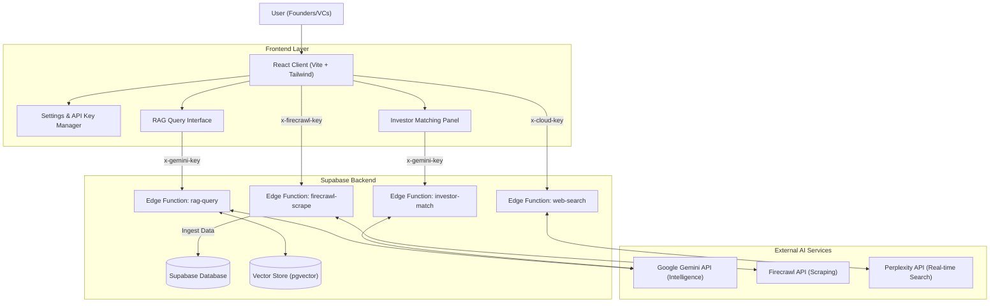

# VentureLens

### **Created by Team InVento**

VentureLens is an advanced **Startup Intelligence Platform** designed to empower founders and analysts with real-time insights, AI-driven investor matching, and deep ecosystem knowledge. It leverages cutting-edge Generative AI (Gemini) and Retrieval-Augmented Generation (RAG) to process vast amounts of unstructured data into actionable intelligence.

---

## 🏗️ Architecture

The system is built on a modern **React + Supabase** stack, utilizing Edge Functions for serverless logic and vector search for semantic understanding.



---

##  Key Features

### 1.  AI-Powered RAG Query
Ask complex questions about the Indian startup ecosystem. The system retrieves relevant chunks from its knowledge base (documents, reports, news) and uses **Google Gemini** to synthesize accurate, cited answers.
- **Hybrid Search**: Combines keyword search with semantic vector search.
- **Source Citation**: Always links back to the original document or web source.

### 2.  Smart Investor Matching
Founders can input their startup profile (Sector, Stage, Funding Needed). The AI analyzes this profile against a database of investors to recommend the best matches.
- **Match Score**: Calculates a fit percentage based on thesis alignment.
- **Talking Points**: Generates personalized pitch strategies for each investor.

### 3.  Automated Data Ingestion
Keep the intelligence fresh by scraping web data.
- **Firecrawl Integration**: Scrape websites and turn them into structured knowledge.
- **Document Processing**: Upload PDF, DOCX, or Excel files to automatically generate embeddings.

### 4.  Secure API Key Management
Privacy-first architecture. Users bring their own API keys.
- **Local Storage**: Keys (Gemini, Firecrawl, Perplexity) are stored encrypted in your browser's `localStorage`.
- **Direct Pass-through**: Keys are sent via secure headers (`x-gemini-key`, `x-cloud-key`) directly to Edge Functions. They are never saved to our database.
- **Custom Database**: Option to connect to your own Supabase project.

---

## 🛠️ Technology Stack

- **Frontend**: React, TypeScript, Vite, Tailwind CSS, shadcn/ui, Lucide Icons.
- **Backend**: Supabase (PostgreSQL, Edge Functions, Storage, Auth).
- **AI/ML**: Google Gemini 1.5 Flash (via AI Studio), OpenAI-compatible API.
- **Vector Search**: `pgvector` for semantic similarity.
- **Data**: Firecrawl (Scraping), Perplexity (Live Search).

---

## ⚙️ Setup & Installation

### Prerequisites
- Node.js & npm
- A Supabase project (or use the provided setup)
- API Keys: Google AI Studio (Gemini), Firecrawl, Perplexity (optional)

### Steps

1. **Clone the Repository**
   ```bash
   git clone https://github.com/Adhz33/VentureLens.git
   cd VentureLens
   ```

2. **Install Dependencies**
   ```bash
   npm install
   ```

3. **Environment Setup**
   Create a `.env` file based on `.env.example` (if available) or ensure your `Vite` environment variables are set:
   ```env
   VITE_SUPABASE_URL=your_supabase_url
   VITE_SUPABASE_PUBLISHABLE_KEY=your_supabase_key
   ```

4. **Run Locally**
   ```bash
   npm run dev
   ```
   Open `http://localhost:8080/` in your browser.

5. **Configure Keys**
   - Click the **Settings (Gear Icon)** in the sidebar.
   - Enter your **Gemini API Key** (for RAG/Matching).
   - Enter your **Firecrawl API Key** (for scraping).
   - Enter your **Cloud API Key** (Perplexity for web search).
   - (Optional) Enter your custom **Supabase URL/Key**.
   - Click **Save**.

---

## 📜 License

This project is proprietary software created by **Team InVento**. All rights reserved.
